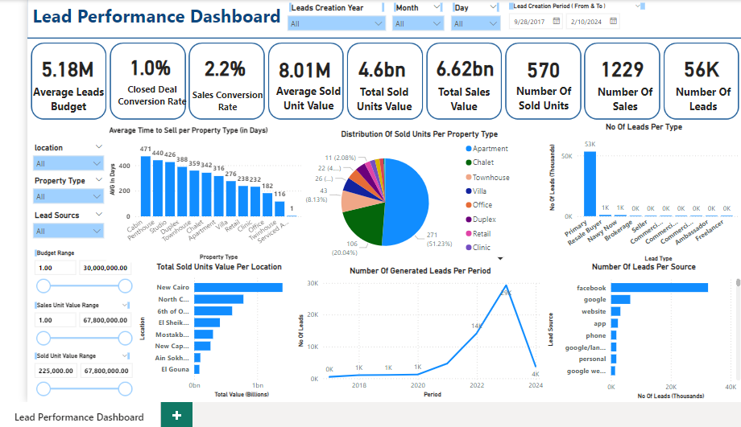

# Lead Performance Dashboard in Power BI

## Project Overview

This Power BI dashboard connects directly to a database as the data source, providing real-time and dynamic visualization of lead and sales performance. 
The dashboard is designed for management, offering insights into lead generation, conversion rates, and sales values across different locations, property types, and lead sources.

---

## Dashboard Features

### Key Metrics

- **Average Leads Budget**
- **Closed Deal Conversion Rate**
- **Sales Conversion Rate**
- **Average Sold Unit Value**
- **Total Sold Units Value**
- **Total Sales Value**
- **Number of Sold Units**
- **Number of Sales**
- **Number of Leads**

### Filters and Slicers

- **Location**: Filter by areas
- **Property Type**: View specific property categories 
- **Lead Source**: Filter by Source of leads 
- **Budget Range**:  budget range of the customers
- **Sales Unit Range**: ranges of sales units
- **Sold Unit Range**: the range of sold units
- **Date Range**: Filter by range of dates of the lead
- **Year**: Filter by year of the lead
- **month**: Filter by month of the lead
- **day**: Filter by day of the lead

---

## Visualizations

### KPI Cards
Each key metric is displayed prominently in KPI cards to provide a quick snapshot of lead and sales performance.

### Detailed Charts

- **Number of Leads per Type**: Distribution of leads by type
- **Average Time to Sell a Unit in Months per Property Type**: Time efficiency in sales per property type
- **Total Sold Units per Location**: Geographic view of unit sales
- **Number of Generated Leads per Period**: Lead generation trends over time
- **Number of Leads per Source**: Highlights the effectiveness of different lead sources

---

## Usage Instructions

1. **Download and Open**: Download the `.pbix` file and open it in Power BI Desktop.
2. **Apply Filters**: Use the slicers to filter by location, property type, lead source, budget range, sales unit range, sold unit range, and date range.
3. **Analyze KPIs and Visuals**: Explore the KPI cards and charts, which automatically update based on the selected filters, giving you a real-time view of the lead-to-sale pipeline.

---

## Screenshots

### Dashboard Overview

